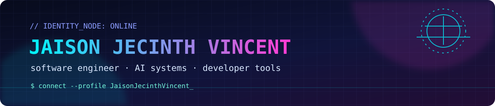

<div align="center">
  
</div>

## `~/profile/README.md`

> **Access granted.** Welcome to my developer console.

I’m **Jaison Jecinth Vincent**, a software engineer exploring **AI systems, developer tools, and interactive engineering experiences**. I enjoy turning complex ideas into practical products—from browser-based hardware simulations to intelligent mail agents and security tooling.

```text
┌─[jaison@github]─[~/projects]
└──╼ focus: build useful systems with a little futuristic polish
```

### ◈ Current focus

- Building practical AI-assisted applications and agent workflows
- Exploring developer experience, browser tooling, and secure software
- Learning by shipping small experiments and substantial systems

### ◈ Technology matrix

`Python` · `JavaScript` · `TypeScript` · `React` · `Node.js` · `AI/ML` · `AWS` · `GitHub Actions`

### ◈ Featured projects

| Project | Signal |
| --- | --- |
| [MQTT-Simulation](https://github.com/JaisonJecinthVincent/MQTT-Simulation) | Browser-based MQTT and IoT experimentation |
| [velxio](https://github.com/JaisonJecinthVincent/velxio) | Interactive coding and hardware simulation platform |
| [Custom-Mail-Classification-Agent](https://github.com/JaisonJecinthVincent/Custom-Mail-Classification-Agent) | AI-assisted email classification |
| [CodeEditor](https://github.com/JaisonJecinthVincent/CodeEditor) | In-browser coding experience |
| [CSEA-IR-Mail-Agent](https://github.com/JaisonJecinthVincent/CSEA-IR-Mail-Agent) | Intelligent mail and information-retrieval workflows |
| [IDE-Extension-for-Vulnerability-Detection](https://github.com/JaisonJecinthVincent/IDE-Extension-for-Vulnerability-Detection) | Security-focused developer tooling |

### ◈ Contribution city

This is a deliberately lightweight, GitHub-safe visual metaphor: contribution activity becomes a neon skyline. The current scene is a hand-crafted baseline that can be replaced later with a generated version from your contribution graph.

<div align="center">
  
</div>

### ◈ Connect

- **GitHub:** [@JaisonJecinthVincent](https://github.com/JaisonJecinthVincent)
- **Projects:** browse the [repositories](https://github.com/JaisonJecinthVincent?tab=repositories)
- **Contact:** add your preferred email or social profile here when ready

### ◈ Customization console

The visual system is intentionally easy to edit:

- Change the identity copy and project descriptions in `README.md`.
- Edit colors, labels, and geometry in `assets/cyber-header.svg`, `assets/contribution-city.svg`, and `assets/cyber-footer.svg`.
- Replace the static city with a generated contribution renderer later without changing the README layout.
- Keep alt text updated when changing visuals so the profile remains understandable without images.

<div align="center">
  
</div>
